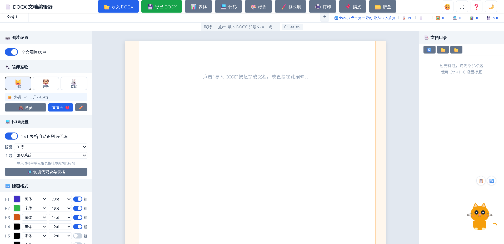
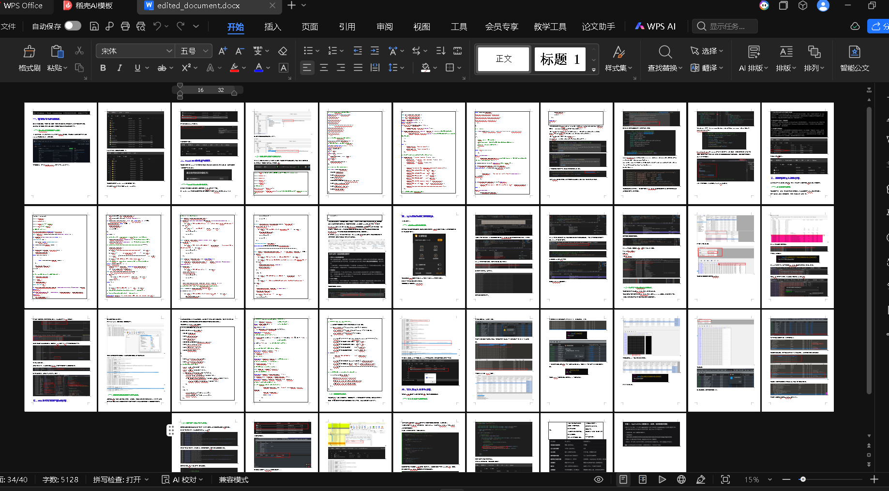
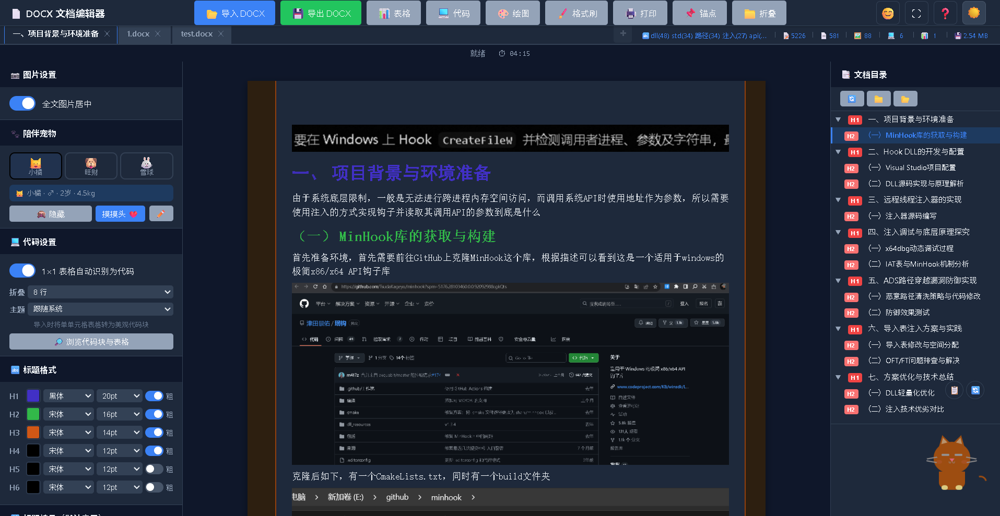
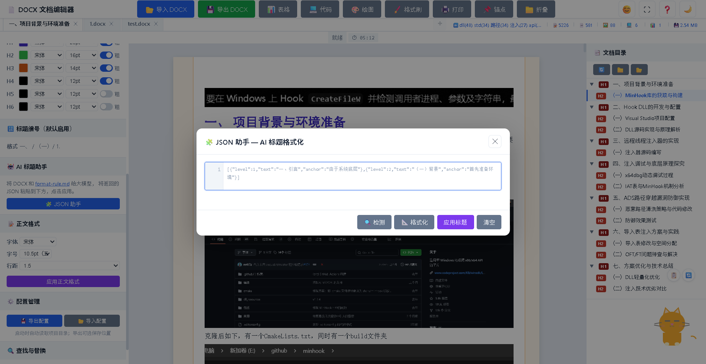
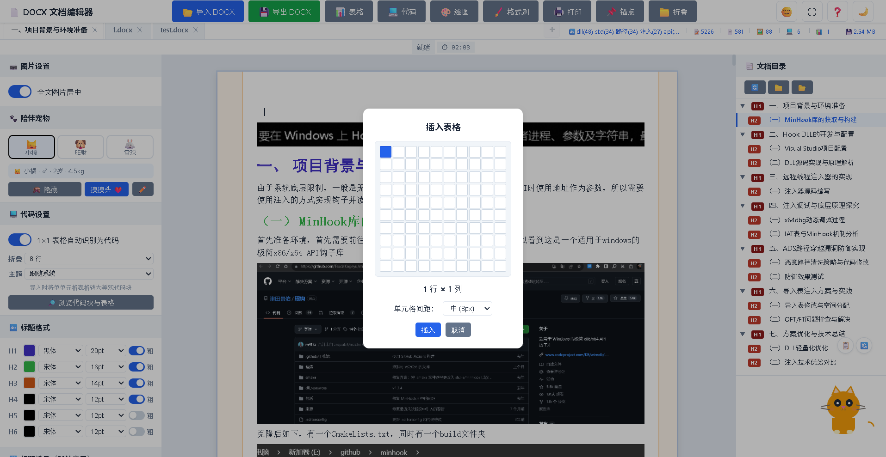
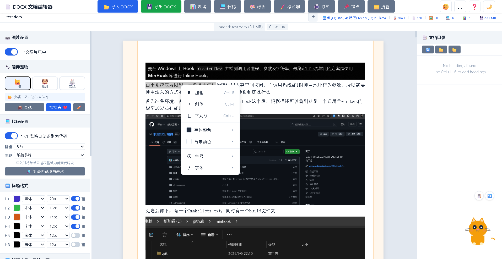
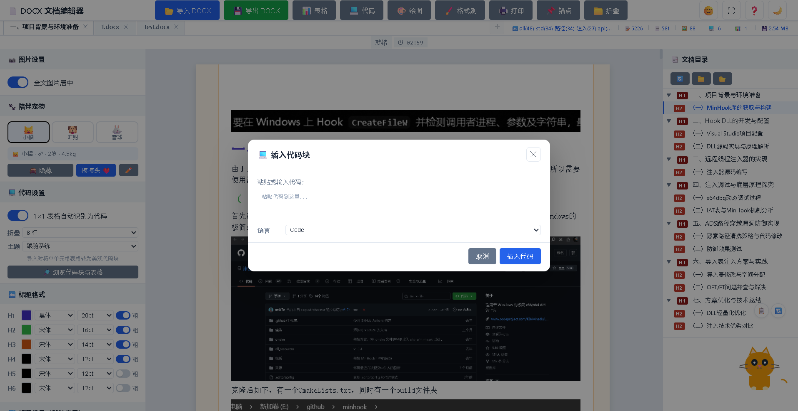
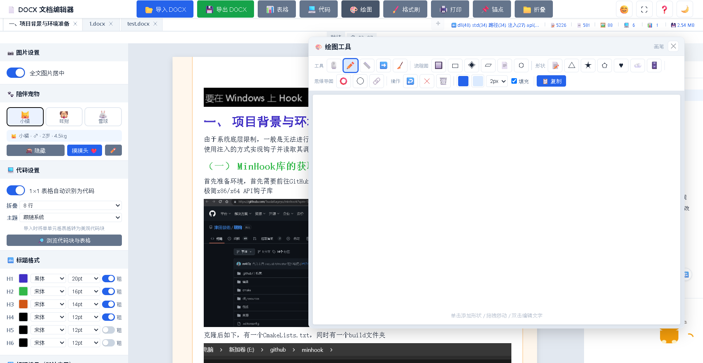
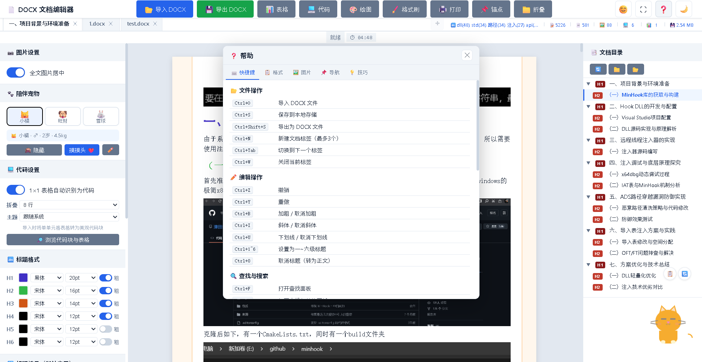

# 📄 DOCX 文档编辑器

> 纯浏览器端的中文 DOCX 文档编辑器 —— 无需后端、无需安装，打开即用。

[](LICENSE)
[](https://github.com)

一个运行在浏览器中的 WYSIWYG（所见即所得）DOCX 文档编辑器，专为中文文档格式化设计。支持导入/导出 `.docx` 文件，提供完整的中文标题编号系统、表格、代码块、图片编辑、绘图等丰富功能。

---

## 📸 界面展示

### 🏠 主界面



编辑器采用经典三栏布局：左侧配置面板、中央编辑区、右侧目录面板。顶部工具栏提供所有核心操作的快捷入口。

### 📥 导入 DOCX


基于 mammoth.js 引擎，将 DOCX 文件转换为 HTML 并在编辑器中呈现。支持多策略回退导入，自动处理标题、表格、图片、代码块等复杂格式。

### 📤 导出 DOCX



编辑完成后一键导出为标准 `.docx` 文件。基于原生 OOXML 生成，完整保留标题层级、中文编号、表格样式、图片、代码块等所有格式，导出文件在 Microsoft Word 和 WPS 中均可完美打开。

### 🌙 暗色主题



内置完整的亮/暗双主题切换，所有组件（编辑器、面板、弹窗）均适配暗色模式，保护夜间写作的视力。

---

## ✨ 功能亮点

### 📝 中文标题编号系统

支持层次化的中文标题格式（一、→（一）→ 1. →（1）），可自定义各级标题的字体、字号、颜色，自动编号且实时预览。

### 🤖 AI 标题助手



创新的 AI 辅助工作流：将 DOCX 文档和格式规则文件发送给大语言模型，获取结构化标题方案 JSON，一键应用到文档对应位置。

### 📊 表格编辑



可视化表格插入选择器，支持自定义单元格间距。完整的表格编辑能力：动态增删行列、右键菜单、单元格样式调整。导出时自动转换为 OOXML 表格格式。

### 🖱️ 右键格式化菜单



编辑器内选中文字后右键，弹出完整的文本格式化菜单，支持粗体、斜体、下划线、删除线、字号、颜色、背景色、字体等快捷设置。

### 💻 代码块



支持多种编程语言的语法高亮代码块，GitHub 风格渲染。导入时自动识别单单元格表格并转换为代码块，导出时完整保留格式。

### 🎨 绘图工具



内置 Canvas 绘图面板，支持流程图、思维导图等矢量绘图。提供铅笔、直线、箭头、矩形、菱形、文本框等多种工具，以及完整的撤销系统。

### 😊 表情符号栏


内置 Unicode 表情符号选择器，支持分类浏览，一键插入文档。

### 🔍 查找与替换


可拖拽的浮动查找替换面板，支持大小写敏感、正则表达式，多匹配高亮和批量替换。

### ❓ 帮助系统



按 F1 打开可拖拽的多标签帮助弹窗，覆盖快捷键、功能说明、使用技巧等内容。

### 📑 多文档标签

支持同时打开最多 3 个文档标签页，每个标签独立管理撤销历史、图片数据和编辑状态。

### 🐾 陪伴宠物

写作陪伴宠物系统，猫/狗/兔可选，可编辑宠物档案，给写作增添趣味。

### 🖼️ 图片编辑器

内置图片编辑器，支持查看/编辑/裁剪三种模式，画笔、橡皮擦、文字标注、矩形、箭头等标注工具。

### 📌 锚点与折叠

编辑器左右装订线支持锚点标记和区域折叠，方便管理长文档结构。

### 💾 自动保存

基于 IndexedDB + localStorage 的双层持久化架构，定时自动保存 + 离开前备份，杜绝数据丢失。

### ⏱ 会话计时器

底部状态栏实时显示编辑会话时长，帮助管理写作时间。

---

## 🚀 快速开始

### 方式一：直接打开

```bash
# 1. 克隆仓库
git clone https://github.com/your-username/docx-helper.git
cd docx-helper

# 2. 安装依赖（仅 mammoth.js 需要 npm）
cd js && npm install && cd ..

# 3. 用任意 HTTP 服务器打开（file:// 协议会有跨域限制）
# Python 方式：
python -m http.server 8080
# Node.js 方式：
npx http-server -p 8080 -c-1

# 4. 浏览器访问
# http://localhost:8080
```

### 方式二：配置 JSON 文件（可选）

在项目根目录放置 `docx-editor-config.json`，编辑器启动时自动读取配置：

```json
{
  "version": 2,
  "headingConfig": {
    "1": { "family": "黑体", "size": "20pt", "bold": true, "color": "#4130c5" },
    "2": { "family": "宋体", "size": "16pt", "bold": true, "color": "#32b849" }
  },
  "bodyFont": "宋体",
  "bodySize": "10.5pt",
  "bodyLineHeight": "1.5",
  "theme": "light"
}
```

### 快捷键

| 快捷键 | 功能 |
|-------|------|
| `Ctrl+O` | 导入 DOCX |
| `Ctrl+S` | 导出 DOCX |
| `Ctrl+E` | 表情符号栏 |
| `Ctrl+F` | 查找 |
| `Ctrl+H` | 替换 |
| `Ctrl+1~6` | 设置标题级别 |
| `F1` | 帮助弹窗 |
| `F9` | 锚点管理 |
| `F11` | 全屏模式 |

---

## 🏗️ 架构设计

```
index.html           ← 单一入口，所有 UI 结构
├── js/app.js        ← 主编辑逻辑（~8050 行，ES5 IIFE）
├── js/export.js     ← DOCX 导出模块（~850 行，ES6 IIFE）
├── js/lib/          ← 第三方库（本地加载，无需 CDN）
│   ├── mammoth.browser.min.js  ← DOCX → HTML
│   ├── jszip.min.js            ← ZIP / OOXML 打包
│   └── FileSaver.min.js       ← 浏览器文件下载
├── css/style.css    ← 完整样式表（~3950 行）
└── docs/screenshots/ ← 截图素材
```

### 设计原则

**零构建，离线优先** — 无需 Webpack/Vite，无需 Node.js 后端。所有第三方库下载到 `js/lib/` 本地引用，断网也能完整运行。

**IIFE 模块化** — 每个 JS 文件是独立的立即执行函数，通过 `window.*` 全局变量进行模块间通信。

**持久化双保险** — IndexedDB（主存储）+ localStorage（兜底备份），每 30 秒自动保存 + 页面离开前同步写入。

### 各功能模块策略

| 功能 | 实现策略 | 关键技术点 |
|------|---------|-----------|
| **DOCX 导入** | mammoth.js 转换 + 后处理管线 | 标题 class→tag 转换、粗体启发式标题检测、单单元格表格→代码块识别、内联格式提取（颜色/字号/字体/下划线/背景色） |
| **DOCX 导出** | 原生 OOXML XML 字符串拼接 | JSZip 打包、DrawingML 图片嵌入、代码块通过 `data-otable` 属性往返、CSS 颜色→OOXML 十六进制转换 |
| **撤销/重做** | 全量 HTML 快照栈（最多 80 步） | beforeinput 事件捕获、400ms 输入防抖、`undoBlocked` 防止撤销期间递归录制、撤销后新编辑截断 redo 分支 |
| **自动保存** | IndexedDB + localStorage 双通道 | 输入防抖 2s 触发、30s 周期备份、beforeunload 同步兜底、启动时 IndexedDB→localStorage 恢复链 |
| **标题系统** | 中文层次编号（一、→（一）→ 1. →（1）） | contenteditable 选区操作、`heading-number` CSS 类控制、编号自动递增 |
| **表格** | 可视化选择器 + 动态行列管理 | 表格右键菜单、单元格间距配置、Tab 键导航、OOXML 表格样式导出 |
| **代码块** | GitHub 风格渲染 + 折叠 | 语法高亮 CSS、行号显示、超长代码自动折叠、1×1 表格智能识别转换 |
| **图片处理** | data URI + imageDataMap 双轨存储 | 导入时提取 DOCX 内嵌图片、导出时转 DrawingML、图片编辑器标注叠加 |
| **绘图** | Canvas 离屏渲染 + 形状对象系统 | 离屏 Canvas 存储自由手绘、形状数组管理矢量对象、30 步撤销栈、连接线系统 |
| **主题切换** | CSS 自定义属性 + 系统偏好检测 | 亮/暗双主题、所有组件完整适配、跟随系统/手动切换 |
| **AI 标题助手** | LLM + JSON 驱动标题批量插入 | format-rule.md 规则文件标准化提示词、锚点匹配定位标题位置 |
| **多标签管理** | 会话隔离架构 | 每个标签独立撤销栈/图片数据/锚点/折叠区域、IndexedDB V2 持久化 |

### 数据流

```
DOCX 文件 → mammoth.js → HTML → 编辑器 contenteditable → 用户编辑
                ↓                                    ↓
          后处理管线                           IndexedDB 自动保存
          (标题/表格/图片)                           ↓
                                             导出为 DOCX
                                          (原始 OOXML XML)
```

### 模块通信

所有模块通过 `window.*` 全局变量通信。主要接口：

- `window.__editorGetContent()` — 获取编辑器 HTML（导出模块调用）
- `window.__editorGetImageData()` — 获取图片数据 Map
- `window.__saveDocument()` / `window.__saveDocumentFull()` — 保存文档
- `window.exportDocx()` — 触发导出

---

## 🛠️ 技术栈

| 类别 | 技术 |
|------|------|
| 运行时 | 纯浏览器端，无后端 |
| DOM 操作 | 原生 JavaScript（contenteditable, Selection API, execCommand） |
| DOCX 导入 | [mammoth.js](https://github.com/mwilliamson/mammoth.js) |
| DOCX 导出 | 原生 OOXML XML 字符串生成 + [JSZip](https://stuk.github.io/jszip/) |
| 持久化 | IndexedDB + localStorage |
| 绘图 | HTML5 Canvas 2D API |
| 样式 | CSS 自定义属性（Design Token 驱动主题切换） |
| 文件保存 | [FileSaver.js](https://github.com/eligrey/FileSaver.js) |

---

## 📂 项目结构

```
docx-helper/
├── index.html                 # 主页面（~1174 行）
├── css/
│   └── style.css             # 全局样式（~3950 行）
├── js/
│   ├── app.js                # 编辑主逻辑（~8050 行）
│   ├── export.js             # DOCX 导出模块（~850 行）
│   ├── lib/                  # 第三方库
│   │   ├── mammoth.browser.min.js
│   │   ├── jszip.min.js
│   │   └── FileSaver.min.js
│   ├── package.json          # npm 依赖配置
│   └── package-lock.json
├── docs/
│   ├── screenshots/           # 界面截图
│   └── 浏览器编辑器内联格式导入导出调试经验.md
├── docx-editor-config.json   # 默认配置文件
├── format-rule.md            # AI 标题规则文件
├── prompt.txt                # LLM 提示词模板
├── 项目设计参考指南.md          # 设计文档
├── CLAUDE.md                 # AI 助手指南
└── README.md                 # 本文件
```

---

## 📝 已知限制

- `app.js` 代码量较大（8000+ 行），未来计划按功能拆分为多模块
- `app.js`（ES5）与 `export.js`（ES6）代码风格不一致
- 仅支持 `.docx` 格式（Word 2007+），不支持旧版 `.doc`
- mammoth.js 不转换颜色/字号/字体/背景色等内联格式（项目已实现额外补丁）

---

## 📄 License

MIT License

---

🤖 本项目使用 [Claude Code](https://claude.ai/code) 辅助开发。
